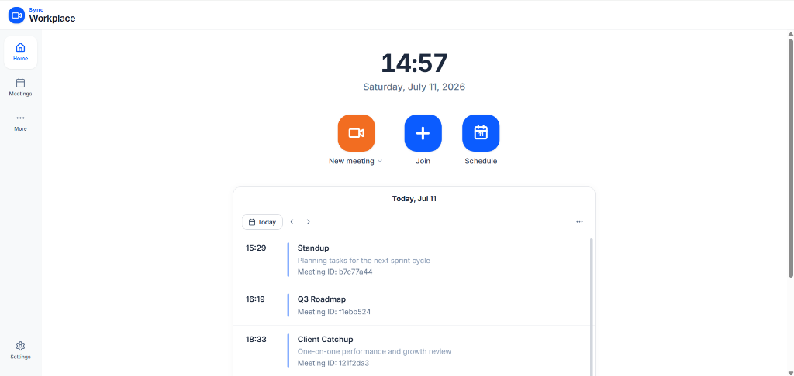
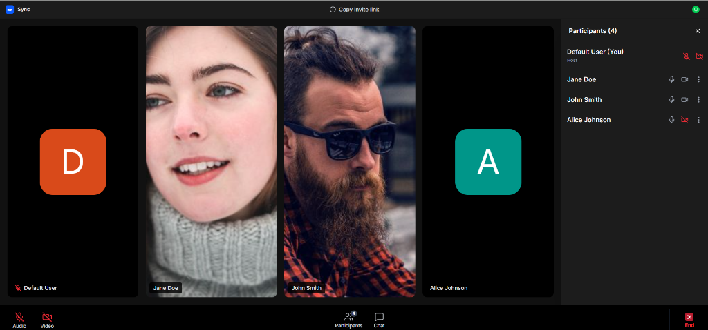
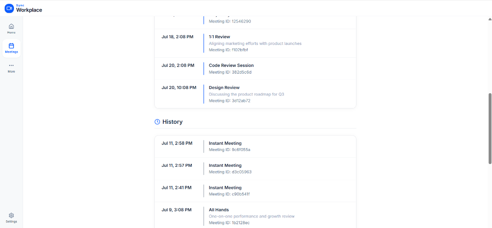

# SyncMeet — Video Conferencing Platform

A full-stack video conferencing web application inspired by Zoom's design and user experience. Built as a SDE Fullstack Assignment.

## Live Demo

- **Frontend (Vercel):** [https://sync-meet-eta.vercel.app](https://sync-meet-eta.vercel.app)
- **Backend API (Azure):** [https://syncmeet-api-a9fsavhxepa2avh7.centralindia-01.azurewebsites.net](https://syncmeet-api-a9fsavhxepa2avh7.centralindia-01.azurewebsites.net)

## Screenshots

### Home Dashboard


### Meeting Room


### Meetings History


---

## Tech Stack

| Layer      | Technology                                          |
|------------|-----------------------------------------------------|
| Frontend   | Next.js (App Router), TypeScript, Tailwind CSS, shadcn/ui |
| Backend    | Python, FastAPI, SQLAlchemy, Pydantic               |
| Database   | SQLite                                              |

---

## Features

### Core Features
- **Landing Dashboard** — Clean, professional Zoom-inspired UI with live clock, action buttons (New Meeting, Join, Schedule), and an upcoming meetings calendar view.
- **Instant Meeting** — Creates a unique 8-character meeting code, generates a shareable invite link, and redirects the user to the meeting room.
- **Join Meeting** — Join an existing meeting by entering a Meeting ID and display name. Validates meeting existence against the database before joining.
- **Schedule Meeting** — Create future meetings with a topic, description, date/time picker, and duration. Auto-generates a meeting link and stores it in the database. Prevents scheduling meetings in the past.
- **Meeting Room** — A realistic mock video conferencing interface with participant video tiles, mic/video toggle controls, participant sidebar, in-meeting chat, and a copy invite link button.
- **Meetings Page** — View all upcoming and past meetings with live/starting-soon badges.

### Bonus Features
- **Responsive Design** — Mobile bottom navigation bar on small screens, desktop sidebar on larger screens. All pages adapt to mobile, tablet, and desktop viewports.
- **Host Controls** — The host can mute participants, stop their video, or remove them from the meeting via a dropdown menu in the participants panel.
- **Database Seeding** — A `seed.py` script generates 30 realistic dummy meetings (past + upcoming) with randomized data relative to the current date.

---

## Database Schema

```
┌──────────────────────┐       ┌──────────────────────┐
│      meetings        │       │    participants       │
├──────────────────────┤       ├──────────────────────┤
│ id (PK)              │───┐   │ id (PK)              │
│ meeting_code (UNIQUE)│   │   │ meeting_id (FK)      │
│ title                │   ├──▶│ participant_name     │
│ description          │   │   │ joined_at            │
│ created_at           │   │   │ left_at              │
│ scheduled_time       │   │   └──────────────────────┘
│ duration             │   │
│ host_name            │   │   ┌──────────────────────┐
│ status               │   │   │  meeting_history     │
└──────────────────────┘   │   ├──────────────────────┤
                           │   │ id (PK)              │
                           └──▶│ meeting_id (FK)      │
                               │ action               │
                               │ timestamp            │
                               └──────────────────────┘
```

**Relationships:**
- A `Meeting` has many `Participants` (one-to-many).
- A `Meeting` has many `MeetingHistory` entries (one-to-many) tracking lifecycle events (created, joined, ended).

---

## Project Structure

```
SyncMeet/
├── frontend/                    # Next.js application
│   └── src/
│       ├── app/                 # Pages (Home, Meetings, Settings, Meeting Room)
│       ├── components/          # Reusable UI components
│       │   ├── modals/          # Join, Schedule, New Meeting modals
│       │   └── ui/              # shadcn/ui primitives
│       ├── hooks/               # React Query hooks for API calls
│       ├── services/            # API service layer (axios)
│       ├── types/               # TypeScript type definitions
│       └── lib/                 # Utility functions
├── backend/                     # FastAPI application
│   ├── main.py                  # App entry point, CORS, router registration
│   ├── routers/                 # API route handlers
│   │   └── meetings.py          # All meeting CRUD endpoints
│   ├── models/                  # SQLAlchemy ORM models
│   │   └── models.py            # Meeting, Participant, MeetingHistory
│   ├── schemas/                 # Pydantic request/response schemas
│   │   └── schemas.py
│   ├── database/                # Database engine & session setup
│   ├── seed.py                  # Database seeding script
│   └── requirements.txt
└── README.md
```

---

## Local Development Setup

### Prerequisites
- Node.js (v18+)
- Python (v3.10+)

### Backend

```bash
cd backend
python -m venv venv
venv\Scripts\activate          # On macOS/Linux: source venv/bin/activate
pip install -r requirements.txt
uvicorn main:app --reload
```
The API will be available at **http://localhost:8000** (interactive docs at `/docs`).

### Seed the Database

```bash
cd backend
venv\Scripts\python seed.py    # On macOS/Linux: python seed.py
```
This generates 30 dummy meetings (15 past + 15 upcoming) with randomized data relative to the current date.

### Frontend

```bash
cd frontend
npm install
npm run dev
```
The application will be available at **http://localhost:3000**.

### Environment Variables

Create a `.env.local` file in the `frontend/` directory:
```
NEXT_PUBLIC_API_URL=http://localhost:8000/api
```

---

## API Endpoints

| Method | Endpoint                    | Description                    |
|--------|-----------------------------|--------------------------------|
| POST   | `/api/meetings/`            | Create a new meeting           |
| GET    | `/api/meetings/recent`      | Get recent (past) meetings     |
| GET    | `/api/meetings/upcoming`    | Get upcoming meetings          |
| GET    | `/api/meetings/{id}`        | Get meeting by ID              |
| GET    | `/api/meetings/code/{code}` | Get meeting by meeting code    |
| POST   | `/api/meetings/join`        | Join a meeting as participant  |
| PUT    | `/api/meetings/{id}`        | Update meeting (e.g. end it)   |

---

## Assumptions

- **No authentication required** — A default user is assumed to be logged in, as specified in the assignment.
- **Simulated video** — The meeting room uses avatar images to simulate video tiles since WebRTC was not in scope.
- **Client-side chat** — In-meeting chat is local to the browser session (not persisted or real-time via WebSocket).
- **Host detection** — The user who created the meeting is considered the host, identified by matching the display name.
